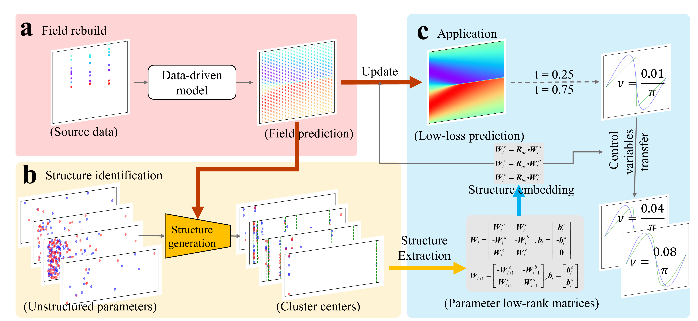
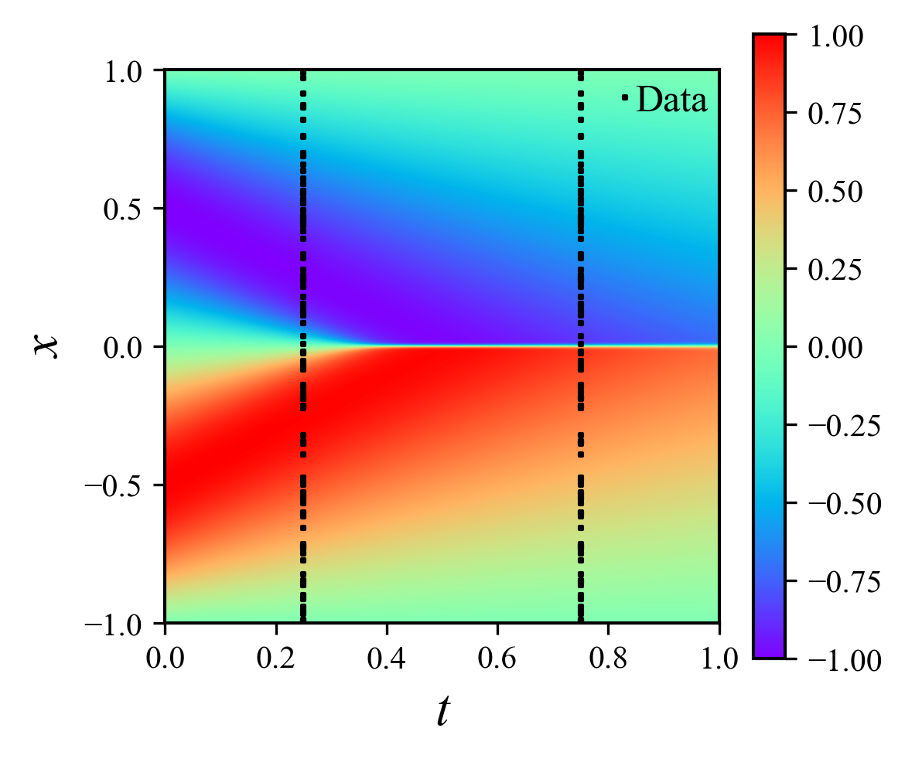
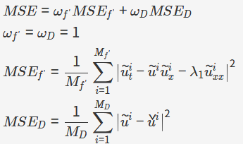
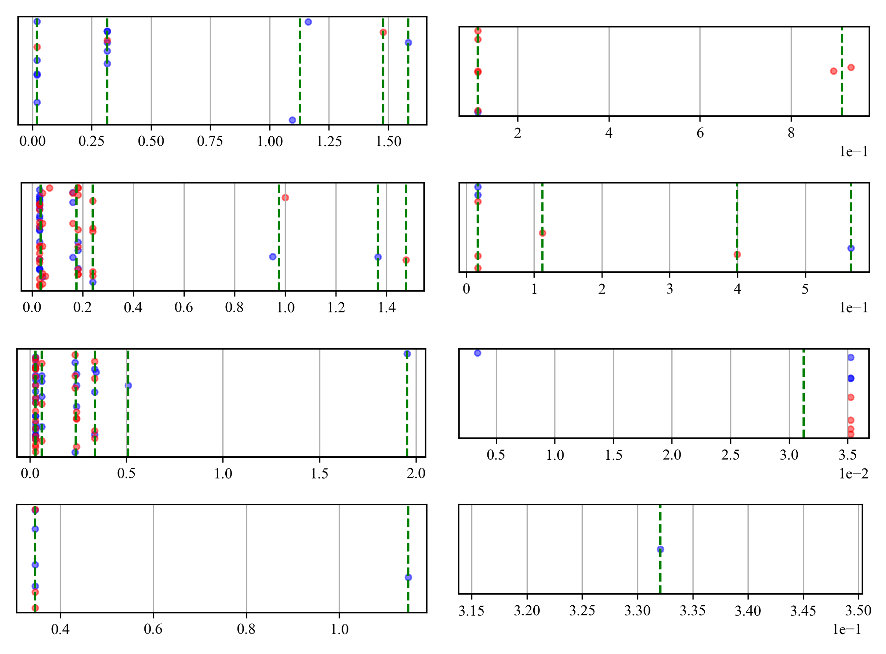
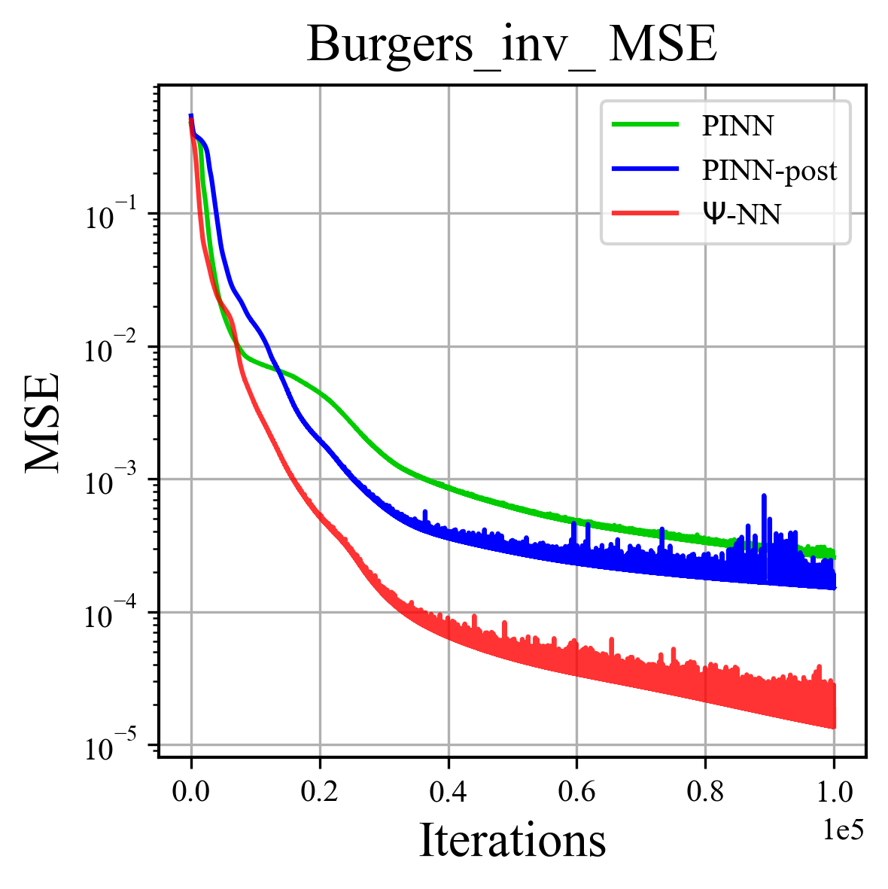

# $\Psi$-NN Project Description

> 🟢 Published in Nature Communications (2025): [DOI: 10.1038/s41467-025-64624-3](https://doi.org/10.1038/s41467-025-64624-3)

$\Psi$-NN adopts a three-step method of "distillation - structure extraction - network reconstruction", which can automatically discover and implicitly embed the physical properties of PDEs into the MLP network structure.



## Example Settings

This codebase provides the $\Psi$-NN method used in the paper, including examples for the Laplace equation, Burgers equation, Poisson equation, and steady-state N-S equations. You can use `Panel.py` to call different config files to enable the corresponding examples.

**Recommended Environment:**

- Python version: 3.11.3
- CUDA version: 11.7
- GPU: RTX 4080
- CPU: Intel 12400f

**Dependency Installation:**

Please install dependencies according to the `requirements.txt` file:

```bash
pip install -r requirements.txt
```

If you need to change dependencies, modify `requirements.txt` and reinstall.

## Code Structure

- **Config/**: Stores hyperparameter configurations (e.g., number of nodes, iterations) for different examples in CSV format. Once computed, configurations should not be changed.
- **Database/**: Stores data required for preset examples (CSV format). You can replace with your own data, but file names must remain the same.
- **Module/**: Contains computational models and workflows.
  - `Training.py`: Core computation methods, including $\Psi$-NN and all examples.
  - `SingleVis.py`, `GroupVis.py`: For result visualization.
  - Other NN-related files: For modular neural network construction. Files with the PINN-post suffix use different hard mapping functions.
- **image/**: Stores images for the README.
- **Panel.py**: Console entry point for easy model invocation. Input the config file name and index to run.
- **pic_parameter.ipynb**: For visualizing the distilled structure of $\Psi$-NN.
- **Results/**: Automatically generated after the first run to save output results.

## Example Results

Taking the Burgers equation as an example:



Its mathematical expression is:

$$
\mathcal{L}:= u_t - u u_x - \lambda_1 u_{xx} = 0, \quad x \in [-1, 1], \quad t \in [0, 1]
$$

Loss function definition:



<!-- $$
\begin{aligned}
    & MSE = \omega_{f'} MSE_{f'} + \omega_{D} MSE_D \\
    & \omega_{f'} = \omega_D = 1 \\
    & MSE_{f'} = \frac{1}{M_{f'}} \sum_{i=1}^{M_{f'}} \left| \tilde{u}_t^i - \tilde{u}^i \tilde{u}_x^i - \lambda_1 \tilde{u}_{xx}^i \right|^2 \\
    & MSE_D = \frac{1}{M_D} \sum_{i=1}^{M_D} \left| \tilde{u}^i - \check{u}^i \right|^2
\end{aligned}
$$ -->

Where:

- $\omega_{f'} = \omega_D = 1$
- $M_{f'}$, $M_D$ are the number of sampling points for the equation and data, respectively.

**$\Psi$-NN Example**
In `Panel.py`, call `Burgers_inv_distill_EXP.csv` and use `pic_parameter.ipynb` to visualize the clustering results of the student network structure.



The left shows weight clustering, the right shows bias clustering, and from top to bottom are layers 1 to 4. The clustering results show trends; specific values may differ across devices, but the structure is similar.

The .ipynb file can also output the replacement results of cluster centers (example):

```
Layer: fc1.weight
Symbolized Weights Matrix:
[['-A' 'B']
 ['-A' 'B']
 ['-A' 'B']
 ['-A' 'B']
 ['-B' '-A']
 ['A' '-B']
 ['B' 'A']
 ['B' 'A']
 ['-B' 'A']
 ['-B' 'A']
 ['-B' '-A']
 ['B' 'A']
 ['A' '-B']
 ['-A' '-B']
 ['-B' '-A']
 ['-B' '-A']]
Cluster Mapping (Letter -> Center):
A: 1.225144624710083
B: 0.043349750339984894
Layer: fc1.bias
Symbolized Weights Matrix:
['A' 'A' 'A' 'A' 'A' '-A' '-A' '-A' '-A' '-A' 'A' '-A' '-A' 'A' 'A' 'A']
Cluster Mapping (Letter -> Center):
A: 0.012397093698382378
```

**Comparison Experiments**
(In `Panel.py`, call `Burgers_EXP.csv` to compare the loss curves of $\Psi$-NN, PINN, and PINN-post.)



---

---

## License

This project is licensed under the Apache License 2.0. See the [LICENSE](./LICENSE) file for details.

## Citation

If you use this code in your research, please cite this project:

```bibtex
@article{liu2025automatic,
  author = {Liu, Ziti and Liu, Yang and Yan, Xunshi and Liu, Wen and Nie, Han and Guo, Shuaiqi and Zhang, Chen-an},
  title = {Automatic network structure discovery of physics informed neural networks via knowledge distillation},
  journal = {Nature Communications},
  year = {2025},
  volume = {16},
  pages = {9558},
  doi = {10.1038/s41467-025-64624-3},
  url = {https://doi.org/10.1038/s41467-025-64624-3}
}
```

If you have any questions, feel free to submit an issue or contact the author.
